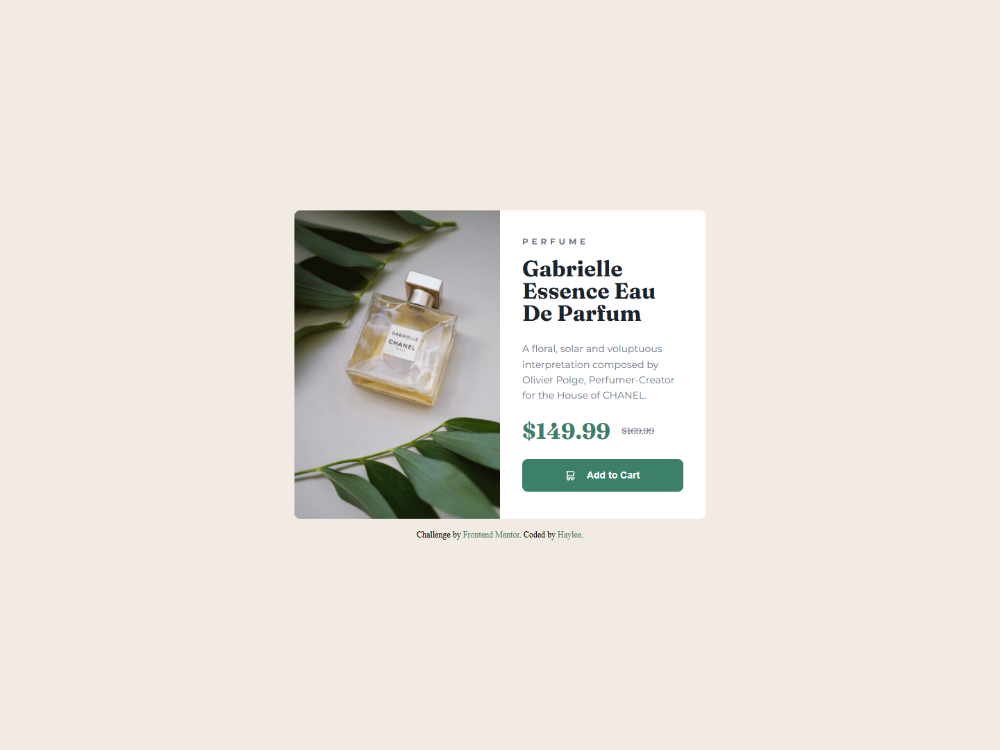

# Product Preview 🚀

## Overview
This is a simple product preview with a hover affect on the "link". Built to be responsive to mobile (WIP)

### Built With
🔴 Semantic HTML

🔴 CSS Custom Properties

🔴 CSS Flex

🔴 "Clickable" Link

### Preview

  

    <b>Mobile Design:</b>
  

  

  
WIP

  

  

    <b>Desktop Design:</b>
  

  

    
  

## Update Progress

### March 8th, 2026

Updated Font and README

### March 5th, 2026

Minor updates to CSS

### February 27th 2026

Gained access to the figma file and adjusted the padding

### February 22nd 2026

Initialized a "CSS reset" and updated the html to include sematic tags

When coding the css, I started with initilizing what size I wanted the font to be, along with seting the colors using root variables